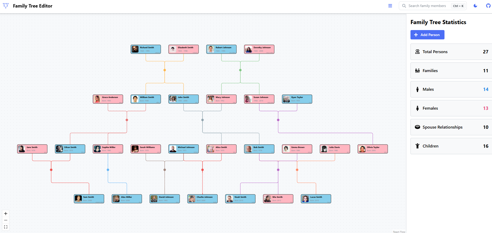

# Family Tree Editor

[](https://github.com/Asamarus/family-tree-editor)

**[Live Demo](https://github.com/Asamarus/family-tree-editor)**

---

## Made With

- [Vite](https://vite.dev/) — Fast frontend build tool
- [React](https://react.dev/) — UI library
- [Mantine](https://mantine.dev/) — React components and hooks
- [MobX](https://mobx.js.org/) — State management
- [ELKjs](https://github.com/kieler/elkjs) — Graph layout engine
- [React Flow](https://reactflow.dev/) — Node-based UI and graph visualization
- [React Icons](https://react-icons.github.io/react-icons/) — Icon library for React

---

## Overview

Family Tree Editor is an interactive web application for creating, editing, and visualizing complex family trees. The app provides a modern, user-friendly interface to manage family relationships, view detailed information, and export/import data.

---

## Features

- **Interactive Family Tree Editor**: Add, edit, and remove family members and relationships directly on the tree.
- **Click for Details**: Click on any family member or relationship link to view and edit detailed information in the sidebar.
- **Relationship Management**: Easily add parents, children and spouses.
- **Sidebar Details**: View and edit person details, family statistics, and relationship information in a sidebar.
- **Search Functionality**: Quickly find family members using the search bar.
- **WikiData Integration**: Search and import person data from WikiData. View family trees for notable people (e.g., kings, actors) and incrementally load large family trees for selected individuals. For some figures, the tree can be very large.
- **Import/Export**: Import and export family trees in GEDCOM format for compatibility with other genealogy tools.
- **Color Themes**: Toggle between light and dark themes.
- **Responsive Design**: Works well on desktop and mobile devices.
- **Full Family Tree View**: Visualize the entire family tree, not just direct ancestors or descendants of a selected person.

---

## Getting Started

### Prerequisites

- [Node.js](https://nodejs.org/)
- [npm](https://www.npmjs.com/) (comes with Node.js)

### Installation

1. **Clone the repository:**
   ```sh
   git clone https://github.com/Asamarus/family-tree-editor.git
   cd family-tree-editor
   ```
2. **Install dependencies:**
   ```sh
   npm install
   ```

### Available npm Commands

- `npm run dev` — Start the development server with hot reload
- `npm run dev-host` — Start the development server accessible on your local network
- `npm run build` — Build the app for production
- `npm run preview` — Preview the production build locally
- `npm run lint` — Run ESLint to check for code issues

### Running the App

- **Development Mode:**

  ```sh
  npm run dev
  ```

  Open [http://localhost:5173/family-tree-editor/](http://localhost:5173/family-tree-editor/) in your browser.

- **Production Build:**
  ```sh
  npm run build
  npm run preview
  ```
  Then visit the local preview URL shown in the terminal.

---

## License

This project is licensed under the MIT License.
